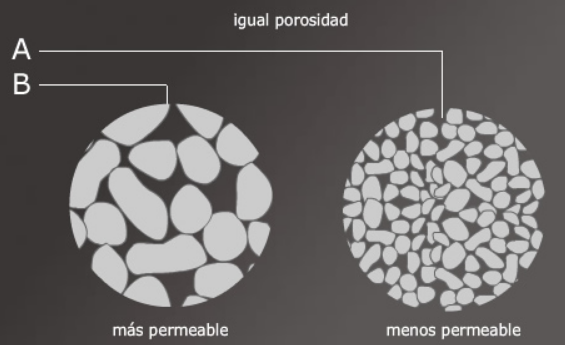

class: center, middle

```{r setup, include=FALSE}
options(htmltools.dir.version = FALSE)
```

```{r xaringan-themer, include=FALSE}
library(xaringanthemer)
# solarized_dark(
#   code_font_family = "Fira Code",
#   code_font_url    = "https://cdn.rawgit.com/tonsky/FiraCode/1.204/distr/fira_code.css",
#   text_bold_color = "#af241a"
# )
duo_accent(
  primary_color = "#006747", 
  secondary_color = "#CFC493",
  code_font_family = "Fira Code",
  code_font_url    = "https://cdn.rawgit.com/tonsky/FiraCode/1.204/distr/fira_code.css")
  #text_bold_color = "#af241a")

```

# Overview

---
# Temas de hoy

- Software propiedades hidráulicas de suelo

- Suelo y propiedades hidráulicas

- Contenido de agua en el suelo

- Humedad aprovechable, lámina de agua, humedad disponible

- Potencial de agua en el suelo

---
class: center, middle

# Software propiedades hidráulicas de suelo

---
# Soil Water Characteristics

- Desarrollado por el Servicio de Concervación de Recursos Naturales, Departamento de Agricultura de los Estados Unidos (USDA).

- Se puede descargar de forma gratuita en el link:
  - https://www.ars.usda.gov/research/software/download/?softwareid=492&modecode=80-42-05-10%20?
  
- Porgrama que permite simular parámetros hídricos del suelo a partir de características texturales.
  
  - Tensión de agua en el suelo
  - Capacidad de retención de agua en el suelo
  - Conductividad

- Es importante entender que entrega valores estimados y pueden no reflejar los valores reales para una situación dada.

---
# Soil Water Characteristics

¿Por qué utilizarlo?

- Las  mediciones  de  campo  y  laboratorio  son  dificultosas,  costosas. 

- Las  correlaciones estadísticas entre la textura del suelo, la curva de retención hídrica y la conductividad hidráulica pueden proveer estimaciones suficientemente correctas para muchos análisis y toma de decisiones. 

- es más fácil contar  con  valores  de  textura,  pero  normalmente  no  es  fácil  contar    con  curvas  de  retención  de  humedad  ni  con  mediciones  de  infiltración  y  conductividad  hidráulica.   

- Permite simular el efecto de:

  - la compactación en el suelo
  - la salinidad en el suelo
  - el contenido de matería orgánica
  - el contenido de gravas 
---
# Soil Water Characteristics

.center[

]

---
class: center, middle

# Suelo: propiedades físicas e hidráulicas

---

# Características importantes del suelo

- Composición y textura

- Estructura y espacio poroso

---
# Composición y textura

La `textura del suelo` se refiere a las cantidades relativas de `tres separaciones` de tamaños distintos que comprenden el componente mineral del suelo.
  
  - Arena, limo y arcilla

.center[

]

---
# Composición y textura

## Clasificación de la textura de suelo (USDA) 

Granulometría por sedimentación: porcentaje de arena, limo y arcilla.

.center[

]

---
# Estructura y espacio poroso

La estructura del suelo se define por la forma en que se agrupan las partículas individuales de arena, limo y arcilla. Cuando las partículas individuales se agrupan, toman el aspecto de partículas mayores y se denominan agregados

La estructura afecta: 

 - la porosidad del suelo
 
 - la retención de agua
 
 - el movimiento de agua
 
Una mala estructura de suelo puede inhibir la infiltración de agua, movimiento de agua y crecimiento de raíces.

---
# Estructura y espacio poroso

**Porosidad:**

 la porción de espacios o cavidades ocupados por agua o aire que existen en la masa de suelo.
 
.center[

]

---
# Estructura y espacio poroso

**Porosidad:**

- Las partículas grandes producen espacios de poro grandes.

- Las particulas pequeñas producen espacios de poros pequeños.

.center[

]

El agua se mueve rapidamente y es debilmente retenida en suelos arenosos de textura gruesa
---
# Estructura y espacio poroso

**Porosidad:**

Permeabilidad es la propiedad que tiene el suelo de transmitir el agua y el aire.

.center[

]

---
# Algunas medidas importantes

- Densidad
  
  - densidad real
  
  - densidad aparente 

- Porosidad

- Relación porosidad/densidad aparente

---
# Algunas medidas importantes

**Densidad**

Relación entre la masa y el volumen

$$\rho=\frac{m}{V}$$

- **densidad real:**  el peso por unidad de volumen de la porción sálida de suelo (sin incluir poros). La densidad aumenta con un mayor contenido de metales pesados (ej., magnetita, limonita y hematita).

- **densidad aparente:** El peso seco de suelo por unidad de volumen includio los poros.

---
# Algunas medidas importantes

.center[

]

¿Cómo calculamos la densidad real?  

--

Densidad real (partícula): 

$\rho_r=\frac{M_S}{V_S}$ 

  gramos de suelo / volumen de suelo =  $g/cm^3$
---
# Algunas medidas importantes

.center[

]

¿Cómo calculamos la densidad aparente?  

--
Densidad aparente:   

$\rho_{ap}=\frac{M_S}{V}$ 

  gramos de suelo / volumen total = $g/cm^3$

---
# Algunas medidas importantes

**Densidad real**

.center[

]

---
# Algunas medidas importantes

**Densidad aparente**

Para suelos minerales co 1-5% de materia orgánica

.center[

]

Suelos orgánicos >20% de materia orgánica. Densidad aparente entre 0,1-0,6 $g/cm^3$.

---
# Algunas medidas importantes

**Densidad aparente**

Factores que afectan la densidad aparente: porosidad - contenido de materia orgánica - textura - compactación - profundidad del perfil

- La compactación disminuye la porosidad, aumenta $\rho_{ap}$

- La agregación aumenta la porosida, disminuye $\rho_{ap}$

- A mayor profundidad del perfil disminuye porosidad, aumenta $\rho_{ap}$

---
# Algunas medidas importantes

**Porosidad** : 

Como consecuencia de la textura y estructura del suelo tenemos su porosidad, es decir su sistema de espacios vacíos o de poros. Proporción de espacio poroso en el suelo.

.center[

]

¿Cuánta es la porosidad?

$$P=\frac{V_v}{V}$$
---
# Algunas medidas importantes

**Porosidad**

No conocemos el volumen de suelo ni el volumen de poros.

Conocemos o podemos conocer la densidad real y densidad aparente.

$$P=1-\frac{\rho_{ap}}{\rho_r}$$

.center[

]
---
# Algunas medidas importantes

Relación de porosidad vs densidad aparente

.center[

]

A medida que aumenta la $\rho_{ap}$ la porosidad baja

A medida que disminuye la $\rho_{ap}$ la porosidad aumenta

---
# Contenido de agua en el suelo

¿Cómo medimos el contenido de agua en el suelo?

- Gravimétrico $(g/g)$

- Volumétrico $(cm^3/cm^3)$

---
# Contenido de agua en el suelo

**Gravimétrico $(g/g)$** (peso seco)

.center[

]

$$\theta_g=\frac{M_{H_2O}}{M_S}=\frac{M-M_S}{M_S}$$
---
# Contenido de agua en el suelo

**Gravimétrico $(g/g)$** (peso seco)

.center[

]

¿Cómo lo obtenemos?

- Pesamos un recipiente

- Tomamos una muestra de suelo y la pesamos en el recipiente (M)

- Lo secamos en horno a 105°C y se la restamos al peso M y tenemos el peso de agua

- Al peso seco le restamos el peso del recipiente

---

# Contenido de agua en el suelo

**Gravimétrico $(g/g)$** (peso humedo)

.center[

]

$$\theta_g=\frac{M_{H_2O}}{M}=\frac{M-M_S}{M}$$
---

# Contenido de agua en el suelo

**Volumétrico $(g/g)$** 

.center[

]

$$\theta_v=\frac{V_{H_2O}}{V}=\frac{M_{H_2O}/\rho_{H2O}}{M_S/\rho_{ap}}=\frac{\theta_g\cdot\rho_{ap}}{\rho_{H_2O}}$$

---
# Estados de humedad del suelo

**Saturación**

  - Contenido de agua equivalente a cuando todos los poros están llenos de
agua.
  - Energia de retención en el suelo a 0 bar
  
  $$\theta_s=P=1-\frac{\rho_{ap}}{\rho_r}$$

**Capacidad de campo**

  - Contenido de agua que permanece en el suelo después de haber drenado
por gravedad
  - Energia de retención entre -0,1 a -0,33 bar
  
**Punto de Marchitez permanente**

  - Contenido de agua en el suelo que no puede ser absorvido por la planta.
  - Energía de retención de -15 bar

---
# Humedad aprovechable (HA) 

.center[

]

---
# Humedad aprovechable (HA)

.center[

]

$HA=(\theta_{cc}-\theta_{pmp})\cdot \frac{\rho_{ap}}{\rho_{H_2O}}\cdot z$

**Lamina de agua (LA)**

$LA=(\theta_1-\theta_2)\cdot \frac{\rho_{ap}}{\rho_{H_2O}}\cdot z$

---
# Humedad aprovechable (HA)

.center[

]
---
# Humedad aprovechable

.center[

]

---
# Umbral de riego

Es un porcentaje  de la  Humedad Aprovechable (HA)  que  tiene  que  consumirse  antes  de  que  se  riegue de nuevo. Este umbral  de  riego  se  fija  dependiendo  de la especie  y  del  estado  de  desarrollo  del 
cultivo.

Humedad disponible

$$HD=HA\cdot UR$$
$HD=(\theta_{cc}-\theta_{pmp})\cdot \frac{\rho_{ap}}{\rho_{H_2O}}\cdot z \cdot UR$

.center[

]

---
# FAO 56

.center[

]
---
class: center, middle

#Potencial de agua en el suelo

---
# Esquema general Suelo-Agua-Planta

.center[

]

---
# Unidades para potencial

Jules, Pascales, Bares, centimetros columna de agua

| Julios/kg | bar  | cbar | cm $H_2O$   | kPa   | MPa   |
|----------:|-----:|-----:|------:|------:|------:|
| 1         | 0.01 | 1    | 10.17 | 100   | 0.001 |
| 100       | 1    | 100  | 1017  | 10000 | 0.1   |
| 1000      | 10   | 1000 | 10170 |       | 1     |  

---
# Definiciones

**Potencial del agua en el suelo:** indica la energía potencial específica por unidad de masa del agua del suelo con relación al agua en un estado de referencia estándar.

**Estado estándar:** Es en forma hipotética un recipiente de agua pura, a la presión atmosférica, a la misma temperatura del agua del suelo y a una elevación constante dada. Por convención se da el valor de cero al agua libre y pura.

**Movimiento de agua en el continuo Suelo-Agua-Planta-Atmósfera**: ocurre por la diferencia (gradiente) de potencial total. Desde zonas donde el agua esta más disponible (humeda) a zonas con menor disponibilidad (secas).

**Dos condiciones de humedad de suelo:** 
  - suelo saturado 
  - suelo no saturado.

---
# Potencial total de agua en el suelo

$$\psi_{T}=\psi_m+\psi_o+\psi_g+\psi_p$$

**Potencial total:** el agua en el suelo está sujeta a una serie de fuerzas que hacen que su potencial difiera de aquel del agua libre. Estas fuerzas corresponde a la atracción de la matriz solída (adhesión y cohesión), la presencia de sales disuelta, la acción de la presión del agua en el suelo saturado y la acción de la fuerza gravitacional.

$\psi_T$: potencial total de agua en el suelo  
$\psi_m$: potencial matricial  
$\psi_o$: potencial osmótico  
$\psi_g$: potencial gravitacional  
$\psi_p$: potencial de presión

---
# Potencial total de agua en el suelo

**Potencial matricial:** es el resultado integrado de las fuerzas de adhesión y cohesión (capilaridad). Estas fuerzas atraen y retienen el agua en el suelo reduciendo su energía potencial por debajo de aquella del agua libre. 

$$h= \frac{0.15}{r}$$

h: altura de ascenso capilar  
r: radio del capilar 

**Potencial gravitacional:** todo cuerpo es atraido al centro de la tierra por la fuerza gravitacional. Está determinado por la elevación de ese punto con respecto a un nivel de referencia dado. Puede ser negativo o positivo dependiendo del punto de referencia elegido.

$$\psi_g= m\cdot g\cdot z$$

m: masa de agua  
g: 9,8 $m/s^2$  
z: profundidad de acuerdo a nivel de referencia

---
# Potencial total de agua en el suelo

**Potencial gravitacional:** 

También se puede expresar como:

$$\frac{\psi_g}{m\cdot g}= z$$

**Potencial osmótico:** la presencia de sales en el agua del suelo baja su potencial. En agua pura es cero, en una solución el potencial es negativo. La diferencia de potencial osmótico origina movimiento de agua entre dos puntos, sin embargo la concentración de sales en un perfil de suelo es aproximadamente similar por el proceso de difusión y la diferencia en la mayoria de los casos es despreciable. Pero es importante desde el punto de vista del trabajo que tiene que ejercer la planta.

De acuerdo a la ecuación de `Van't Hoff`

$$\psi_o = -\frac{n}{V}\cdot R\cdot T$$
R: constante universal de los gases (8,314 J/ mol K)  
$n/V$: molaridad de la solución (mol/l)  
T: temperatura absoluta (K)  

---
# Potencial total de agua en el suelo

**Potencial de presión**: en suelo `saturado`  la fase líquida tiene una presión hidrostática mayor que la atmosférica y por lo tanto el potencial se considera positivo.

**Potencial total de agua en el suelo**

$$\psi_{T}=\psi_m+\psi_o+\psi_g+\psi_p$$

Para que ocurra el movimiento la diferencia de potencial total entre dos puntos debe ser distinta de cero. Si entre dos dos puntos el agua se encuentra a la misma energia, no hay movimiento.

---
# Curva característica de humedad de suelo

Relaciona el contenido de humedad con el potencial de agua en el suelo.

Curva característica para un suelo arenoso.


---
# Curva característica de humedad de suelo

Curva característica para distintos tipos de suelo


---
#Referencias

Vazquez Amabile, Gabriel. (2015). Introducción y Tutorial en español al programa ???Soil Water Characteristics??? Hydraulic Properties Calculator ( Saxton y Rawls) para estudiantes de la Maestría de Cuencas Hidrográficas de la Univ Nac de La Plata.. 10.13140/RG.2.1.2709.5527. 

Saxton, K. E., W. J. Rawls, J. S. Romberger and R. I. Papendick. 1986. Estimating generalized soil water 
characteristics from texture. Trans. Amer. Soc. Agri. Engr., 50(4):1031-1035. 


