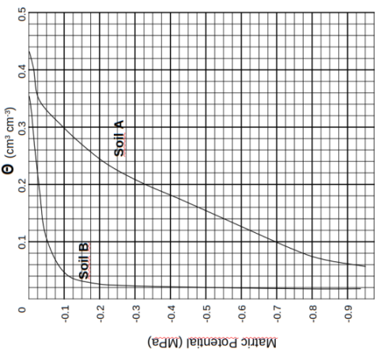
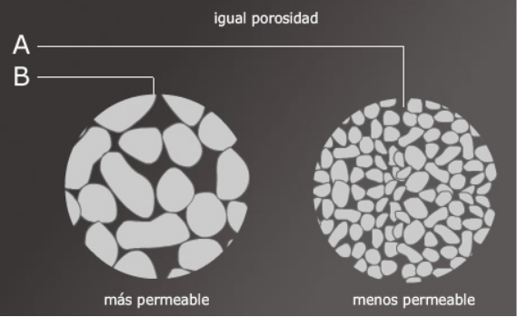
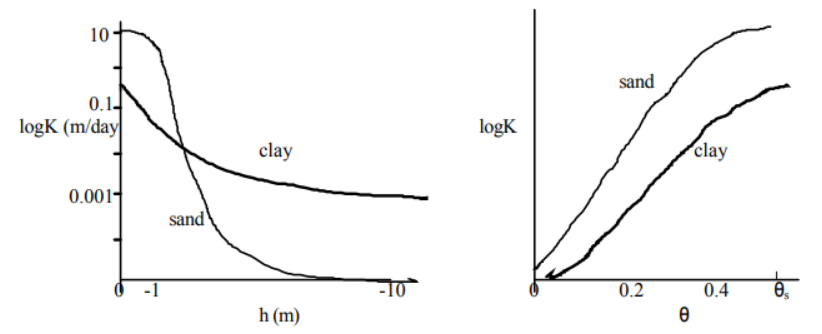
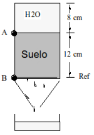
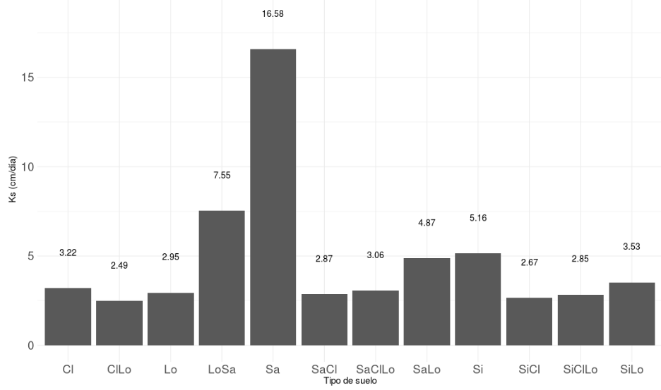
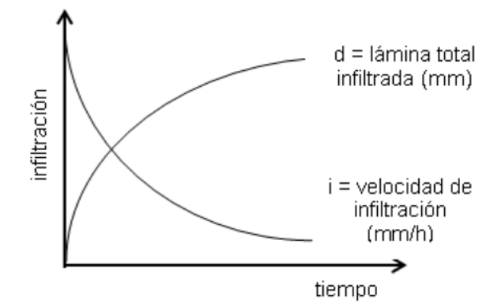
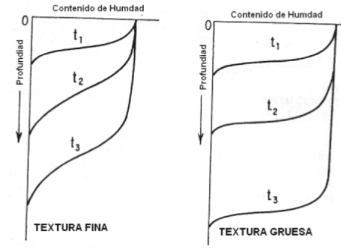
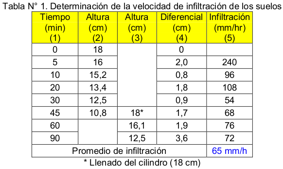
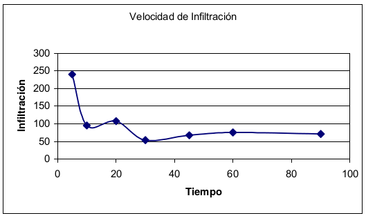

```{r setup, include=FALSE}
options(htmltools.dir.version = FALSE)
```

```{r xaringan-themer, include=FALSE}
library(xaringanthemer)
# solarized_dark(
#   code_font_family = "Fira Code",
#   code_font_url    = "https://cdn.rawgit.com/tonsky/FiraCode/1.204/distr/fira_code.css",
#   text_bold_color = "#af241a"
# )
duo_accent(
  primary_color = "#006747", 
  secondary_color = "#CFC493",
  code_font_family = "Fira Code",
  code_font_url    = "https://cdn.rawgit.com/tonsky/FiraCode/1.204/distr/fira_code.css")
  #text_bold_color = "#af241a")

```

# Temas 

- Flujo de agua en el suelo

  - Estados de agua en el suelo.
  
  - Conductividad hidráulica 
  
  - Ley de Darcy
  
  - Velocidad de infiltración e infiltración acumulada

---
# Recordando

Curva de retención de agua en el suelo

.center[

]

---

# Estados de agua en el suelo

Dos situaciones: 

- Suelo saturado

- Suelo no saturado

El flujo de agua en el suelo es diferente para estos dos tipos de estado.

¿Cuál será más complicado de estudiar? ¿Por qué?

---

# Permeabilidad

Es una medida de la capacidad de un material poroso (ej., suelo) de permitir que un fluido (ej. agua) fluya a través de él.

**Permeabilidad intrínseca:** es función del material y no del fluido. 

**Permeabilidad real (conductividad hidráulica):** es función del material y del fluido.

$$k=K\frac{\mu}{\rho\cdot g}$$

k: permeabilidad intrínseca $(m^2)$  
K: conductividad hidráulica $(m/s)$  
u: viscocidad dinámica del fluido $(kg/(m\cdot s))$  
$\rho$: densidad del fluido $(kg/m^3)$  
g: aceleración de gravedad $(m/s^2)$  

---
# Permeabilidad

**Permeabilidad** tiene que ver con el tamaño de los poros.

**Porosidad** corresponde a la cantidad total de espacio poroso que existe en
el suelo



---
# Conductividad hidráulica

La facilidad con que el agua se mueve a través del suelo.

Responsable de como se distribuye el agua en el volumen de suelo.

Determina la tasa a la cual se mueve el agua en el suelo.

Depende de:

- **Textura** - partículas pequeñas = poros pequeños = baja conductividad

- **Densidad** - alta densidad implica baja porosidad y poros pequeños

- **Estructura** - una mejor agregación de macroporos mejora la conductividad

- **Contenido de humedad** - el agua deja los poros grandes primero. A bajo contenido de humedad, los poros pequeños conducen el agua, reduciendo la conductividad. La máxima conductividad se encuentra bajo condiciones de
saturación.

---
# Conductividad hidraulica vs contenido de humedad

Utilice Soil Water Characteristics para ver como varia la conductividad hidráulica en funcíon del contenido de humedad.

- Considere:

    - un suelo arenoso (sand) 
    
    - un suelo arcilloso (clay).
    
    - otro suelo.
    
- Explique las diferencias.

---

# Conductividad hidráulica en suelo no saturado

En condiciones de suelo no saturado la conductividad hidráulica es función del potencial matricial/contenido de humedad del suelo.

A saturación la conductividad hidráulica alcanza su mayor valor,  $(K_s)$ (conductividad hidráulica a saturación)

La conductividad hidráulica disminuye a medida que el suelo tiene menor contenido de humedad.

---

# Conductividad hidráulica en suelo no saturado

.center[

]
---
# Ley de Darcy

El agua en el suelo se mueve desde más humedo a más seco.

Desde dónde está más disponible hacia donde está retenida con más fuerza.

Desde un nivel de potencial mayor a uno de menor potencial.

Entonces. ¿Qué hace que el agua fluya en el suelo?  

--

**Gradiente de potencial** de agua en el suelo

Gradiente = $\frac{\Delta \Psi }{\Delta z}$

---
# Ley de Darcy

Flujo de agua en suelo saturado

El volumen de agua que pasa por una sección de area $A$ en un determinado tiempo es proporcional al gradiente de potencial de agua.

--

$$\frac{V}{A\cdot t}\quad \alpha \quad  Gradiente = \frac{\Delta \Psi }{\Delta z}$$
$$q= -K_s \cdot \frac{\Delta \Psi}{\Delta z}$$
Ecuación de Darcy de flujo en suelo saturado.

q = $(m/s)\quad (cm/hr)$  
$K_s= (m/s)\quad (cm/hr)$

---
# Ley de Darcy: Ejemplo

Conductividad hidráulica saturada

Dada una columna de suelo que tiene un área de 80 $cm^2$, una carga constante de agua de 8 $cm$ y despues de 7 horas han sido almacenados 450 $cm^3$ de agua en el recipiente debajo de la muestra de suelo. Tomar como nivel de
referencia el punto B. Calcular la conductividad hidráulica a saturación.

.center[

]

---
# Ley de Darcy: Ejemplo

Tenemos que:

$$q = \frac{V}{A\cdot t} = -K_s \cdot \frac{\Delta \Psi}{\Delta z}$$
**Primero:** Se calcula el potencial de agua entre dos puntos

¿En presencia de qué tipo de potenciales estamos en caso de suelo saturado?

--
$$\Psi_T=\Psi_p+\Psi_g$$
--

$\Psi_A=8\quad cm + 12\quad cm$  
$\Psi_B=0\quad cm + 0\quad cm$  
$\Delta z=12\quad cm$

Entonces:

$$\frac{\Delta \Psi}{\Delta z} = 1,67 cm$$
---
# Ley de Darcy: Ejemplo

Reemplazando

$$q = \frac{V}{A\cdot t} = -K_s \cdot \frac{\Delta \Psi}{\Delta z}$$

$$\frac{450\quad cm^3}{80\quad cm^2\cdot 7\quad horas} = K_s \cdot 1,67$$

$$K_s=0,48\quad cm/hr$$

---
#Conductividad hidráulica saturada

Distintos tipos de suelo

.center[

]

---
# Flujo de agua en suelo saturado

## ¿Puede ser mayor el flujo en un suelo arcilloso que en un arenoso?

--

## ¿Que debe suceder para que sea mayor el flujo en un suelo arcilloso?

---
#Flujo de agua en suelo no saturado

** Ley de Darcy (Saturado)** 

$$q =  -K_s \cdot \frac{\Delta \Psi}{\Delta z}$$

** Ley de Darcy-Buckingham (no saturado)**

Estado estable

$$q=-K(\Psi_m)\cdot \frac{\partial \Psi_T}{\partial z}$$

---
# Infiltración

La velocidad de infiltración puede definirse como los metros por unidad de tiempo de entrada de agua en el suelo.

- Infiltración es el proceso mediante el cual se incorpora el agua al suelo, desde la superficie del mismo hacia las capas más profundas, en sentido predomoninantemente vertical.

- Las fuerzas mecánicas que actuan son principalmente el potencial mátrico $(\Psi_m)$ y en menor medida, el potencial gravitatorio $(\Psi_g)$.

- No se debe confundir velocidad de infiltración con conductividad hidráulica. ¿Por qué?

---
# Velocidad de infiltración e infiltración acumulada


La velocidad de infiltración disminuye hasta alcanzar el equilibrio cuando el suelo está saturado y alcanza la velocidad de infiltración mínima. (Conductividad hidráulica mayor, $K_s$ )

La lámina infiltrada (mm) aumenta hasta que el perfil de suelo se encuentra completamente saturado, momento en el qué la velocidad de infiltración se hace mínima y así también es mínima la lámina infiltrada.

---
# Velocidad de infiltración e infiltración acumulada

.center[

]

---
# Velocidad de infiltración e infiltración acumulada

La velocidad de infiltración es diferente para distintos tipos de suelo.

**Arena:**  Velocidad de infiltración mayor

**Arcilla:** Velocidad de infiltración menor

¿Por qué?

---
# Velocidad de infiltración e infiltración acumulada

.center[

]

---

# Modelos de infiltración

**Kostiakov (1932)**

Velocidad de infiltración 

$$ VI(t) = k\cdot t^\alpha$$
Infiltración acumulada

$$IA (t) = \alpha \cdot k\cdot t^{\alpha-1}$$

Otros:

- Green-Ampt
- Lewis-Kostiakov
- Horton

---
# Infiltración y conductividad hidráulica

- Conductividad hidráulica aumenta con el contenido de humedad 

- Conductividad hidráulica alcanza su mayor valor a saturación

- Velocidad de infiltración disminuye al aumentar el contenido de humedad 

- Velocidad de infiltración alcanza su menor valor a saturación


¿ Por qué pasa esto?
---
# Métodos para medir la velocidad de infiltración

- Cilindro infiltrómetro simple

- Cilindro infiltrómetro doble

https://www.youtube.com/watch?v=PYvfTxQhbOQ

---
# Prueba de cilindro de infiltración

.center[

]

---
# Prueba de cilindro de infiltración

.center[

]

---
# Infiltración

¿Para qué nos sirve esto?

¿En riego?
