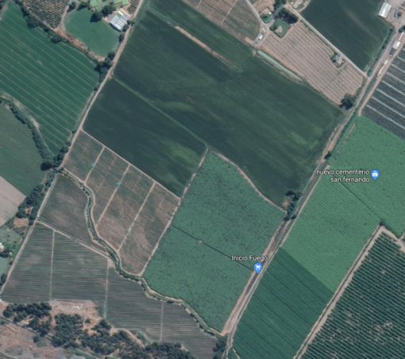
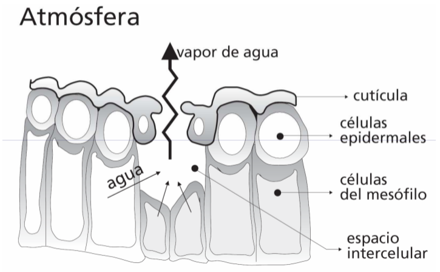

```{r setup, include=FALSE}
options(htmltools.dir.version = FALSE)
```

```{r xaringan-themer, include=FALSE}
library(xaringanthemer)
# solarized_dark(
#   code_font_family = "Fira Code",
#   code_font_url    = "https://cdn.rawgit.com/tonsky/FiraCode/1.204/distr/fira_code.css",
#   text_bold_color = "#af241a"
# )
duo_accent(
  primary_color = "#006747", 
  secondary_color = "#CFC493",
  code_font_family = "Fira Code",
  code_font_url    = "https://cdn.rawgit.com/tonsky/FiraCode/1.204/distr/fira_code.css")
  #text_bold_color = "#af241a")

```

# Temas 

- Flujo de agua en el continuo planta-atmósfera

  - Potenciales de agua en la planta
  
  - Potencial de agua en el aire
  
  - Transpiración
  
      - Difusión en la hoja
  
      - Déficit de presión de vapor (DPV)
  
  - Evapotranspiración
  
      - Introducción
  
---
# Continuo suelo agua planta atmósfera

.center[

]

---
# Potencial de agua en la planta

$$\psi_t=\psi_o+\psi_p$$
$\psi_t$: potencial hídrico total  
$\psi_o$: potencial osmótico (-)  
$\psi_p$: potencial de turgor (+)  

- Las plantas utilizan el potencial de agua para transportar el agua a las hojas para que se pueda realizar la fotosíntesis

- El potencial hídrico es una medida del potencial energético en el agua, así como la diferencia entre el potencial en una muestra de agua dada y el agua pura.

- El potencial osmótico (de soluto) $(\psi_o)$ disminuye al aumentar la concentración de soluto; una disminución en $\psi_o$ causa una disminución en el potencial total de agua.

---
# Potencial de agua en la planta

Potencial total = bomba scholander

 

---
# Potencial de agua en la planta

Potencial total = bomba scholander


---

# Potencial de agua en la planta

Potencial de turgor = Sensores ZIM 

 

---

# Potencial de agua en la planta

Potencial de turgor = Sensores ZIM 

 


---
# Ajuste osmótico

.center[

]

---
# PIM: estado hídrico en Kiwis

.center[

]

---
# PIM: estado hídrico en Kiwis

**Objetivo:** Buscar relaciones entre potencial hídrico con índices de imágenes satelitales Sentinel-2

.center[

]

---
# PIM: estado hídrico en Kiwis

.center[

]

---
# PIM: estado hídrico en Kiwis


---
# Potencial de agua en el aire

.center[

]

---
# Potencial de agua en el aire

¿Potencial de agua en el suelo?

¿Potencial de agua en la hoja?

¿De qué depende el potencial de agua en el aire?

---
# Potencial de agua en el aire

El potencial de agua en el aire $(\psi_a)$ depende de la humedad relativa del aire (HR) y de la temperatura.

$$\psi_a =\frac{R\cdot T\cdot ln(HR/100)}{V_w}$$

R: constante universal de los gases $(8,3 J/Mol \cdot K)$  
T: Temperatura del aire (K)  
$V_w$: volumen molar parcial de agua (1,805x10^{-5} m^3/mol)

**Humedad relativa**: se define como el tanto por ciento de presión de vapor que tiene el aire respecto de la máxima presión de vapor (saturación) que puede tener a esa temperatura.

$$HR=\frac{e}{e_s}\cdot 100$$

e: presión de vapor del aire  
$e_s:$ presión de vapor del aire saturado

---
# Potencial de agua en el aire

.center[

]

---
# Potencial de agua en el aire

## Ejemplo

Calcular el $\psi_a$ a una temperatura del aire de 20°C y HR de 50%

$$\psi_a=\frac{8,31(J/mol\cdot K)\cdot(20+273)K\cdot ln(0.5)}{1,805x10^{-5} (m^3/mol)}$$


$$1[J]=1\frac{Kg\cdot m^2}{s^2}$$

$$1[Pa]=1\frac{Kg}{m\cdot s^2}$$

$$1x10^5[Pa] = a[bar]$$

$$\psi_a=-935[bar]=-93,5[MPa]$$


---
# Potencial de agua en el aire

**Variación durante el día:** Estación San Jorge (INIA), región del Maule

.center[

]

---
# Patron de potencial en el continuo Suelo-Planta-Atmósfera


---
#Transpiración

## Factores climáticos que afectan la transpiración

.center[

]

---
# Transpiración

- Las plantas requieren grandes cantidades de agua como consecuencia de la evolución de su aparato **fotosintético**.

- Menos de **1%** del agua absorbida por las plantas queda en ella. 

- La transpiración está determinada por la **demanda evaporativa de la atmósfera**, el porcentaje de cubierta del suelo por el cultivo y las
características de los estomas.

- El suelo afecta la transpiración en forma indirecta. Los suelos secos, salinos, fríos afectan la transpiración sólo si resultan en cierre de estomas
o menor cubierta del suelo. Lo mismo ocurre con las enfermedades o pestes que afectan a las raíces.

- El flujo de agua en el continuo suelo-planta-atmósfera se controla en la interfase entre las hojas y la atmósfera.

- La transpiración es un proceso de **difusión**

---
#Difusión

La **difusión** molecular desde un punto de vista microscópico y macroscópico. Inicialmente hay moléculas de soluto en el lado izquierdo de una barrera (línea color púrpura) y no hay ninguna en la derecha. Cuando se elimina la barrera, el soluto se difunde para ocupar completamente el contenedor.

.center[

]

**Superior:** Una única molécula se mueve en forma aleatoria.
**Centro:** Con un mayor número de moléculas, se observa una clara tendencia de parte del soluto a llenar más uniformemente el contenedor.
**Inferior:** Con un enorme número de moléculas de soluto, la aleatoriedad se convierte en indetectable: el soluto parece moverse suave y sistemáticamente desde las áreas de alta concentración a las áreas de baja concentración.

---
# Difusión

Evaporación de agua de la planta hacia la atmósfera.

.center[

]

---
# Difusión

## Capa Limite

La capa límite es una delgada capa de aire inmóvil alrededor de la hoja. Para que la transpiración ocurra, el vapor de agua que sale de los estomas debe difundirse a través de esta capa de aire estático para alcanzar la atmósfera, donde el vapor de agua será removido por el aire en movimiento.

$$CL=4\cdot \sqrt{\frac{l}{v}}$$

CL: grosor de la capa límite (mm)    
l: largo de la hoja (m)  
v: velocidad del viento (m/s)  

---
# Difusión

.center[

]

---
# Difusión: Ley de Fick

$$J=\frac{Q}{A\cdot t}=-D_j\cdot \bigg(\frac{\delta C}{\delta x}\bigg)$$
J: Flujo $(kg/m²\cdot s)$  
Q: cantidad de un gas J (kg)  
A: área $(m^2)$  
t: tiempo (s)  
$D_j$: coeficiente de difusión $(m^2/s)$  
$\delta C$: diferencia de concentración $(kg/m^3)$  
$\delta x$: distancia (m)  
$\frac{\delta C}{\delta c}$: gradiente de concentración $(kg/m^4)$

---
#Déficit de presión de vapor (DPV)

$$DPV = e_s -e$$

$e:$ presión de vapor del aire  
$e_s$: presión de vapor del aire saturado 

.center[

]

---
# Evapotranspiración

$$ET = E + T $$

**Evaporación:** es el proceso por el cual el agua líquida se convierte en vapor
de agua (vaporización) y se retira de la superficie evaporante (remoción de
vapor).

**Transpiración:** consiste en la vaporización del agua líquida contenida en los
tejidos de la planta y su posterior remoción hacia la atmósfera.

--

¿Qué se necesita para evaporar(transpirar)?

Energía

$$DPV=e_{sup} - e_{atm}$$

$e_{sup}$: presión de vapor en la superficie evaporante

$e_{atm}$: presión de vapor en la atmósfera

---
# Evapotranspiración

Unidades para ET

Evapotranspiración = mm/tiempo

$\frac{mm}{hora}$, $\frac{mm}{día}$, $\frac{mm}{mes}$

**Equivalencias**

.pull-left[
1ha = 10.000 $m^2$

1mm = 0,001 m
]

.pull-right[
1 mm = 10 $m^3/ha$

1 $\frac{mm}{día}$ = 10 $\frac{m^3}{há\cdot día}$
]


---
# Evapotranspiración

**Calor latente de vaporización.**

.pull-left[
También se puede expresar en términos de la energía recibida.

A 20° C se requieren $\lambda = 2,45 \frac{MJ}{Kg}$

1 Kg = 0,001 $m^3$ ( $\rho_{H_2O}$ = 1000 $Kg/m^3$ )
]

.pull-right[

$2,45 \frac{MJ}{m^2}=0,001 m = 1 mm$

$\lambda \cdot ET = \frac{MJ}{m^2}$

]

.center[

]

---
# Evapotranspiración

**Ejemplo**

En un día de verano, la energía solar neta recibida en un lago alcanza 15 MJ
por metro cuadrado por día.

¿Si el 80% de la energía se usa para evaporar el agua, cual es el valor de la altura de agua evaporada?

--

1 $\frac{MJ}{m^2\cdot día}=0,408 mm/día$

$0,8\cdot 15 \frac{MJ}{m^2\cdot día} = 0,8\cdot 15\cdot 0,408 mm/día =4,9 mm/día$

---
# Evapotranspiración

**Factores que afectan la ET**

--

.pull-left[
`Variables climáticas`

- radiación solar
- humedad
- temperatura
- velocidad del viento
]

--

.pull-rigth[
`Factores de cultivo:`

- tipo
- variedad
- etapa de desarrollo
]

--

..

`Manejo y condiciones ambientales:`

- salinidad o baja fertilidad
- contenido de humedad del suelo
- enfermedades
- mal manejo del suelo

---
# Evapotranspiración

## Conceptos

.center[

]

---
# Evapotranspiración

## Conceptos

**Evapotranspiración de referencia (ET):** 

- Tasa de evapotranspiración de una superficie de referencia.

- Para estudiar la demanda de evapotranspiración de la atmósfera

- Los únicos factores que afectan ET son los parámetros climáticos.

---
# Evapotranspiración

## Conceptos

**Evapotranspiración de cultivo (ET estandar):** refiere a la evapotranspiración de cualquier cultivo cuando se encuentra exento de enfermedades, con buena fertilización y que se desarrolla en parcelas amplias, bajo óptimas condiciones de suelo y agua, y que alcanza la máxima producción de acuerdo a las
condiciones climáticas reinantes.

.center[

]

---
# Evapotranspiración

**Evapotranspiración de cultivo (ET estandar):** Debido a variaciones en las
características del cultivo durante los diferentes periodos de crecimiento, para
un determinado cultivo, K cambia desde la siembra hasta la cosecha.

.center[

]

---
# Evapotranspiración

**Métodos para estimar ET**

- FAO 56 Penman-Monteith (R, V, HR, T, e)

- Hargraves-Samani ( $T$, $T_{min$, $T_{max}$} )

- Priestley Taylor (Radiación)

- Berti et al. (2014) (Modifica Hargreaves-Samani)