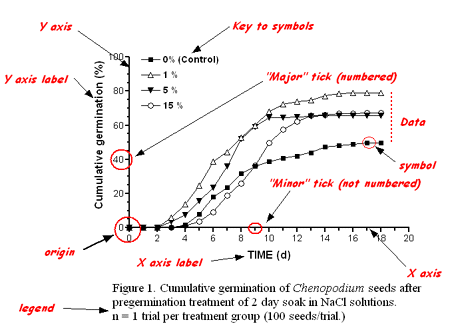

```{r setup, include=FALSE}
knitr::opts_chunk$set(echo = TRUE)
Sys.setenv(LANG = "es")
```

# Introducción

Desde el punto de vista climatológico, actualmente en Chile no contamos con una densidad de estaciones  meteorológicas suficientes, que esten distribuidas de forma espacial sobre el territorio y que además cuenten con registros históricos (más de 30 años). Esto dificulta el desarrollo de estudios en el contexto de la variabilidad climática y el cambio climático y con ello la toma de decisiones para diversas actividades. Los principales organimos nacionales que cuentan con redes de estaciones climatológicas a lo largo de Chile son: la Dirección Meteorológica de Chile (DMC) y la Dirección General de Aguas (DGA). Uno cuenta con registros históricos (DMC) pero baja densidad de estaciones, el otro (DGA) cuenta con mayor densidad de estaciones pero tiene problemas en cuanto a su registro continuo en el tiempo. En este sentido, el Centro de Ciencia del Clima y la Resilencia [(CR)2](http://www.cr2.cl) de la Universidad de Chile realiza la recolección de los datos climáticos desde estas dos fuentes y los deja disponibles de forma pública a través de su explorador climático (http://explorador.cr2.cl/).

Además, a partir de datos históricos globales obtenidos de estaciones climatológicas Fick and Hijmans (2017) desarrollaron los mapas climatológicos globales a una resolución de 1 km para el periodo 1970-2000 [wordlclim 2](http://www.worldclim.org). Estos mapas cuentan con variables de precipitación, temperatura, radiación solar, velocidad del viento y presión de vapor de agua en forma mensual.

# Objetivo del laboratorio

Realizar el análisis de datos de precipitación y temperatura mensual para el periodo 1970-2000 para las siguientes ciudades o localidades:

- Quinta Normal, 
- Osorno
- Copiapo.

Comparar entre fuentes de datos climáticos puntuales de Chile (explorador climático del CR2) y datos obtenidos mediante interpolación espacial de redes de estaciones climáticas mundiales (wordlclim 2)

# Metodología

- Descargar desde la página del explorador climático del (CR)2 ([http://explorador.cr2.cl/](http://explorador.cr2.cl/)) los datos de precipitación y temperatura media diarios entre el año 1970 al 2000.

- Agregar los datos de temperatura y precipitación en forma mensual y obtener los promedios mensuales (apoyese con tablas dinámicas)

- Calcular el promedio 1970-2000 de la precipitación acumulada mensual y de la temperatura media mensual.

- Comparar los datos obtenidos en el punto anterior con los datos de Worldclim 2 obtenidos como resultado del Taller 1.

- Calcular la anomalía (desviación) de la precipitación para el periodo 2010-2018, como la diferencia entre la precipitación acumulada mensual (2010-2018) y el promedio mensual (1970-2010)

# Resultados esperados

1. Crear una figura para precipitación mensual promedio (1970-2000) y precipitación obtenida de Worldclim 2, en el que se comparen ambas curvas (Figura 1).

2. Crear una figura para temperatura mensual promedio (1970-2000) y temperatura obtenida de Worldclim 2, en el que se comparen ambas curvas (Figura 2).

3. Crear una figura para la anomalía de precipitación entre 2010-2018 (Figura 3).

4. En un párrafo a continuación de cada figura describa lo que se presenta y discuta lo más importante (diferencias, variaciones en el tiempo).

# Requisitos

- Cada Figura debe cumplir el formato de acuerdo a lo presentado al final de este documento. Debe tener una leyenda en la parte inferior, títulos en los ejes con unidades, graduación y no debe llevar título.

- Se debe entregar un informe técnico breve en formato PDF el que debe ser subido a la plataforma blackboar del curso (campus virtual). No más de cinco páginas, si todo lo pedido lo puede entreggar en menos, cuanto mejor.

- El documento debe contener:
  - Portada: Título, nombres, fecha
  - Introducción: Un párrafo
  - Objetivo
  - Métodos: Qué es worldclim 2? qué es el explorador climático del CR2? cómo se hizo?
  - Resultados: figuras con descripción y discusión.
  - Conclusión: 

# Fecha de entrega

