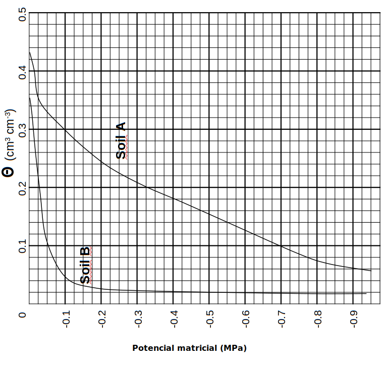

```{r setup, include=FALSE}
knitr::opts_chunk$set(echo = TRUE)
Sys.setenv(LANG = "es")
```

# Introducción

Para poder realizar el diseño de un sistema de riego es fundamental el conocer las característcas hidráulicas
del suelo. Para esto es necesario estimar la curva de retención hídrica y la conductividad hidráulica. Las mediciones de campo y laboratorio son dificultosas, costosas y a menudo impracticables para muchos análisis. Por lo tanto las correlaciones estadísticas entre la textura del suelo, la curva de retención hídrica y la conductividad hidráulica pueden proveer estimaciones suficientemente correctas para muchos análisis y toma de decisiones. El software “Soil Water Characteristics” desarrollado por el USDA, contiene una interfase gráfica que, a partir de los contenidos de arena y arcilla, provee las relaciones del contenido hídrico y tensión (punto de marchitez, capacidad de campo y saturación) y conductividad hidráulica saturada (Ksat) y no saturada. Las ecuaciones del modelo fueron desarrolladas por medio de correlaciones de una extensa base de datos de 1722 muestras provista por el Nacional Soil Survey Laboratory del NRCS del USDA. Las soluciones del modelo son válidas para todas las texturas excepto para aquellas con contenidos de arcilla superior al 60%. Soil Water Characteristics permite al usuario incluir variaciones en el contenido de materia orgánica, % de gravas (volumétrico o gravimétrico), nivel de salinidad y nivel de compactación. El efecto de la materia orgánica fue evaluado en correlaciones con la textura, en tanto que las otras tres variables modificadoras fueron evaluadas en base a literatura y datos adicionales.

# Objetivo

Análizar las propiedades hidráulicas y curva característica del suelo utilizando el software `Soil Water Characteristics`

# Fecha y forma de entrega: 14 mayo 2019 hasta las 11:30 subir documento con las respuestas al blackboard.

# Preguntas

1. Obtener propiedades hidráulicas desde datos de textura

Complete la siguiente tabla:

| Muestra|Arena (%)|Limo (%)|Arcilla (%)|Clasificación|Densidad aparente ($g/cm^3$)|Porosidad (%)|
|--------|:-------:|:------:|:---------:|:-----------:|:--------------------------:|:------------|
| 1      |    73   |  8     |  19       |             |                            |             |
| 2      |43       |  28    |  29       |             |                            |             |
| 3      |78       |  18    |  4        |             |                            |             |
| 4      |44       |  42    | 14        |             |                            |             |
| 5      |29       |  30    | 41        |             |                            |             |
| 6      |65       |  13    | 23        |             |                            |             |


\newpage

a) De la tabla anterior se utilizarán las muestras 3, 4 y 5 para las siguientes preguntas. Para cada una de estas texturas construya la curva característica de retención de agua en el suelo (tensión vs contenido de humedad). Utilice Microsoft Excel para los gráficos

b) Seleccione una de las muestras,  utilizando `Soil Water Characteristics` haga variar el contenido de sales. ¿Qué sucede con la tensión del agua en el suelo? ¿Por qué?

c) Seleccione una de las muestras,  utilizando `Soil Water Characteristics` haga variar la compactación ¿Qué sucede con la tensión del agua en el suelo?¿Por qué?

d) Seleccione una de las muestras,  utilizando `Soil Water Characteristics` haga variar el porcentaje de materia orgánica ¿Qué sucede con la tensión del agua en el suelo?¿Por qué?

2. Dos tensiómetros cuyas cápsulas están instalados en un suelo a diferentes profundidades: A=40 cm,
B=70 cm. Ambos tensiómetros marcan 80 cb (1 bar = 100 cb). (Asuma el nivel del suelo como el nivel
de referencia).

a) ¿Cuál es el potencial del agua en los puntos A y B?

b) ¿Hacia dónde se mueve el agua? ¿Por qué?

3. La curva de retención de humedad (aka: curva característica de humedad de suelo) para dos tipos de suelo se muestra en la Figura 1.



a) ¿Cuál es el contenido de humedad a capacidad de campo (CC) y punto de marchitez permanenete (PMP) para los dos suelos?

b) ¿Cuál es la humedad aprovechable para cada suelo?


c) Supongamos que ambos suelos tienen 1,0 m de profundidad, y a esa profundidad tienen un lecho rocosco impermeable. ¿Qué cantidad de agua (en cm o m: tenga en cuenta que 1 $cm^3$ de agua por $cm^2$ de área de suelo equivale a 1 cm de agua), se deberá aplicar a un suelo completamente seco (A y B) para saturar todo el perfil del suelo.

d) ¿Cuánta agua podra retener cada perfil de suelo por un periodo relativamente prolongado si el lecho rocoso permitiese la percolación? Explique.

e) El mismo tipo de cultivo se encuentran en cada uno de los perfíles de suelo y sus raíces cubren todo el perfil. Si el cultivo puede extraer agua en forma efectiva de un suelo a $\psi_m=-0.8 MPa$, asumiendo una profundiad de 1m, ¿cuánta agua (en cm) puede extraer el cultivo desde cada perfil, comenzando desde capacidad de campo (-0.03 MPa). ¿Qué pasa con un cultivo diferente que puede extraer agua a un $\psi_m=-0.2 MPa$. Explique.

# Referencias {-}

Vazquez Amabile, Gabriel. (2015). Introducción y Tutorial en español al programa “Soil Water Characteristics”
Hydraulic Properties Calculator ( Saxton y Rawls) para estudiantes de la Maestría de Cuencas Hidrográficas
de la Univ Nac de La Plata.. 10.13140/RG.2.1.2709.5527.

Saxton, K. E., & Rawls, W. J. (n.d.). Soil Water Characteristic Estimates by Texture and Organic Matter for Hydrologic Solutions. https://doi.org/10.2136/sssaj2005.0117
